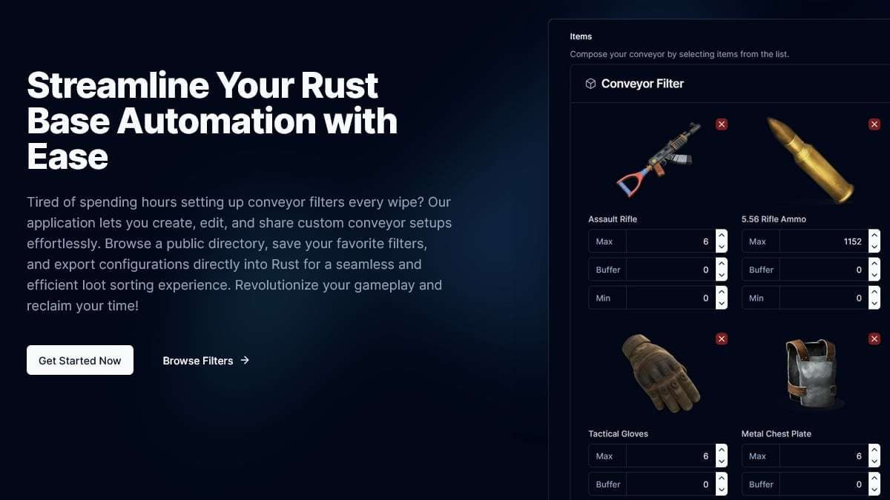

# Rust Conveyor Filters

[](https://discord.gg/DGzAHXvU93)

This project is a web application for generating, editing, and sharing Rust conveyor filters. It is built with Next.js and TypeScript, and leverages various libraries and tools to provide a seamless user experience.



## ✨ Features

- 🎮 Visual filter builder that mirrors the in-game experience
- 💾 Import your existing filters directly from the game
- 📤 Export configurations with one click
- 🌐 Browse and learn from other players' setups
- 📱 Full mobile support for planning on the go

## 🚀 Quick Start

### Prerequisites

You'll need:

- Node.js
- Package manager (npm, yarn, pnpm, or bun)

### Installation

1. Clone and enter the project:

   ```bash
   git clone https://github.com/tostesdaniel/rust-conveyor-filters.git
   cd rust-conveyor-filters
   ```

2. Install the dependencies:

   ```bash
   npm install   # or yarn/pnpm/bun install
   ```

3. Fire it up:

   ```bash
   npm run dev   # or yarn/pnpm/bun dev
   ```

### Running the Development Server

Start the development server:

```bash
npm run dev
# or
yarn dev
# or
pnpm dev
# or
bun dev
```

Visit [http://localhost:3000](http://localhost:3000)

## 🏗️ Project Structure

```text
rust-conveyor-filters/
├── src/
│   ├── actions/               # Server actions
│   ├── app/                   # Next.js app router pages and layouts
│   │   ├── (app)/             # Main application pages
│   │   ├── (legal)/           # Terms and privacy pages
│   │   ├── (resources)/       # Public resources
│   │   └── api/               # Route handlers
│   ├── components/            # Reusable React components
│   │   ├── about/             # About page components
│   │   ├── analytics/         # Analytics hooking
│   │   ├── donate/            # Donation related components
│   │   ├── feedback/          # Feedback related components
│   │   ├── filters/           # Public filters components
│   │   ├── landing-page/      # Home page components
│   │   ├── my-filters/        # User filters components
│   │   ├── steam-guide/       # Steam guide components
│   │   └── ui/                # Shared UI components
│   ├── config/                # App metadata & config
│   ├── db/                    # Database schema & setup
│   │   └── seed-data/         # Seed data for the database
│   ├── hooks/                 # Custom React hooks
│   ├── lib/                   # Utility functions and constants
│   │   ├── donation/          # Donation webhook validation
│   │   ├── queries/           # Database queries
│   │   ├── stats/             # Cron jobs
│   │   └── utils/             # Utility functions
│   ├── providers/             # React context providers
│   ├── schemas/               # Form schema definitions
│   ├── scripts/               # Scripts for the project
│   │   └── monthly-update/    # Monthly update script
│   ├── services/              # Services for the project
│   └── types/                 # TypeScript type definitions
└── public/                    # Static assets
    ├── icons/                 # App icons
    ├── images/                # Static images
    └── items/                 # Item assets
```

## ⚙️ Contributing

Please refer to the [CONTRIBUTING.md](CONTRIBUTING.md) file for instructions on how to contribute to this project.

## 🛠️ Built With


## 🤝 Contributing

Got ideas? Found a bug? Contributions are welcome! Here's how you can help:

- 🐛 Report bugs
- 💡 Suggest new features
- 🔧 Submit pull requests

## 📝 License

This project is licensed under the GNU General Public License v3.0 (GPL-3.0).

## 📬 Get in Touch

Have questions? Join our [Discord community](https://discord.gg/DGzAHXvU93) or email me at <tostes.dev@gmail.com>.

---

<div align="center">

## Made with ❤️ for the Rust community

[Join Discord](https://discord.gg/DGzAHXvU93) • [Report Bug](https://github.com/tostesdaniel/rust-conveyor-filters/issues) • [Request Feature](https://github.com/tostesdaniel/rust-conveyor-filters/issues)

</div>
