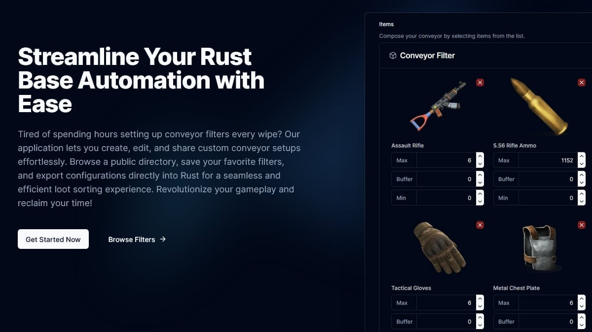

# Rust Conveyor Filters

[](https://discord.gg/DGzAHXvU93)

This project is a web application for generating, editing, and sharing Rust conveyor filters. It is built with Next.js and TypeScript, and leverages various libraries and tools to provide a seamless user experience.



## ✨ Features

- 🎮 Visual filter builder that mirrors the in-game experience
- 💾 Import your existing filters directly from the game
- 📤 Export configurations with one click
- 🌐 Browse and learn from other players' setups
- 📱 Full mobile support for planning on the go

## 🚀 Quick Start

### Dev container (recommended)

The repo ships a dev container, so the only things you need installed are
[Docker](https://docs.docker.com/get-started/get-docker/) and the
[Dev Containers extension][devcontainers]. It contains Bun, Node 24, and Postgres 16.

1. Clone the repo and open it in VS Code.
2. Choose **Reopen in Container**.
3. Add your [Clerk](https://dashboard.clerk.com/sign-up) dev keys to the
   generated `.env`, then `bun run db:seed` and `bun dev`.

The container also blocks dependency install scripts and holds every package to
a three-day release-age gate, so a poisoned release can't run code on your
machine. See [CONTRIBUTING.md](CONTRIBUTING.md#development-environment-setup)
for the details.

[devcontainers]: https://marketplace.visualstudio.com/items?itemName=ms-vscode-remote.remote-containers

### Local install

You'll need [Bun](https://bun.sh) 1.3+ (or Node.js 24 with npm/yarn/pnpm) and a
Postgres 16 server.

```bash
git clone https://github.com/tostesdaniel/rust-conveyor-filters.git
cd rust-conveyor-filters
bun install
bun run db:start     # postgres:16 in Docker, port 5433
cp .env.example .env # then fill in your Clerk keys
bun run db:setup
bun dev
```

Visit [http://localhost:3000](http://localhost:3000).

Full walkthrough, including which Clerk settings to toggle, in
[CONTRIBUTING.md](CONTRIBUTING.md#development-environment-setup).

## 🏗️ Project Structure

```text
rust-conveyor-filters/
├── src/
│   ├── actions/               # Server actions that mutate data
│   ├── app/                   # Next.js app router pages and layouts
│   │   ├── (app)/             # Main application pages
│   │   ├── (legal)/           # Terms and privacy pages
│   │   ├── (resources)/       # Public resources
│   │   └── api/               # Route handlers
│   ├── components/            # Reusable React components
│   │   ├── about/             # About page components
│   │   ├── analytics/         # Analytics hooking
│   │   ├── donate/            # Donation related components
│   │   ├── feedback/          # Feedback related components
│   │   ├── filters/           # Public filters components
│   │   ├── landing-page/      # Home page components
│   │   ├── my-filters/        # User filters components
│   │   ├── steam-guide/       # Steam guide components
│   │   └── ui/                # Shared UI components
│   ├── config/                # App metadata & config
│   ├── data/                  # Database data access functions
│   ├── db/                    # Database schema & setup
│   │   └── seed-data/         # Seed data for the database
│   ├── hooks/                 # Custom React hooks
│   ├── lib/                   # Utility functions and constants
│   │   ├── donation/          # Donation webhook validation
│   │   ├── queries/           # Server functions that fetch data
│   │   ├── stats/             # Cron jobs
│   │   └── utils/             # Utility functions
│   ├── providers/             # React context providers
│   ├── schemas/               # Form schema definitions
│   ├── scripts/               # Scripts for the project
│   │   └── monthly-update/    # Monthly update script
│   ├── services/              # Services for the project
│   └── types/                 # TypeScript type definitions
└── public/                    # Static assets
    ├── icons/                 # App icons
    ├── images/                # Static images
    └── items/                 # Item assets
```

## 🛠️ Built With


## 🤝 Contributing

### Quick Start

Check out our [CONTRIBUTING.md](CONTRIBUTING.md) guide for detailed instructions on getting started.

### Ways to Contribute

- 🐛 Report bugs and issues
- 💡 Suggest new features or improvements
- 📝 Improve documentation
- 🔧 Submit pull requests
- 🗣️ Share the project with others

### 🌟 Contributors Wall

Thanks to all the contributors who take their time to make this project better!

<!-- markdownlint-disable -->
<!-- readme: contributors -start -->
<table>
	<tbody>
		<tr>
            <td align="center">
                <a href="https://github.com/tostesdaniel">
                    
                    <br />
                    <sub><b>Daniel Tostes</b></sub>
                </a>
            </td>
            <td align="center">
                <a href="https://github.com/nic-w">
                    
                    <br />
                    <sub><b>Nic</b></sub>
                </a>
            </td>
		</tr>
	<tbody>
</table>
<!-- readme: contributors -end -->
<!-- markdownlint-restore -->

## 📝 License

This project is licensed under the GNU General Public License v3.0 (GPL-3.0).

## 📬 Get in Touch

Have questions? Join our [Discord community](https://discord.gg/DGzAHXvU93) or email me at <tostes.dev@gmail.com>.

---

<div align="center">

## Made with ❤️ for the Rust community

[Join Discord](https://discord.gg/DGzAHXvU93) • [Report Bug](https://github.com/tostesdaniel/rust-conveyor-filters/issues) • [Request Feature](https://github.com/tostesdaniel/rust-conveyor-filters/issues)

</div>
